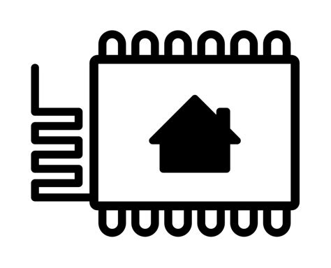

## PV1800 inverter, ESP32, YAML, http, mqtt, HomeAsistant, Domoticz and RS485


---




## **Efficient RS485 Device Control with Home Assistant and ESP32**

Combining Home Assistant with an ESP32 equipped with an RS485 module offers a potent programming solution for effective RS485 device control.

| **Advantages**                                  | **Description**                                                                                       |
|-------------------------------------------------|-------------------------------------------------------------------------------------------------------|
| **Unified Automation Platform**                 | Home Assistant acts as a unified platform, providing a central interface for managing RS485 devices.|
| **ESP32's Robust Hardware**                     | The ESP32's capabilities and GPIO pins make it suitable for seamless integration with RS485 devices.|
| **RS485 Translation Capability**                | The ESP32's RS485 module enables bidirectional communication, effectively translating commands.     |
| **Real-time Monitoring and Control**            | Home Assistant's real-time updates and automation features allow responsive control over devices.  |
| **Custom Logic and Integrations**               | Programmers can implement custom logic and leverage Home Assistant's integrations for versatility.|

By combining the strengths of Home Assistant and an ESP32 with an RS485 module, programmers can develop a comprehensive control solution, translating commands and achieving seamless interaction with RS485 devices while benefiting from real-time monitoring and flexible automation capabilities.


---

## **Utilizing Domoticz for Logs and RS485 Device Data**

Domoticz, a popular home automation software, presents compelling reasons for programmers seeking to collect logs and RS485 device data through programming.

| **Advantages**                                 | **Description**                                                                             |
|-----------------------------------------------|---------------------------------------------------------------------------------------------|
| **Logging Capabilities**                       | Domoticz offers built-in logging features, simplifying the process of collecting event data. |
| **RS485 Device Integration**                   | The platform supports integration with RS485 devices, easing the retrieval of device data.  |
| **Extensive Plugin System**                    | Its plugin system allows programmers to customize data collection and integration processes.|
| **Web-based Interface**                        | The web interface facilitates easy access to logs and device data for monitoring and analysis.|
| **Community Support**                          | Domoticz boasts an active community that provides assistance and resources for programmers. |

By harnessing the features of Domoticz, programmers can efficiently develop programs to gather logs and RS485 device data while benefiting from its extensibility and supportive community.

---


---


## **Boosting Power and Flexibility with MQTT Integration**

The integration of MQTT (Message Queuing Telemetry Transport) significantly enhances the capabilities of both Home Assistant and Domoticz in terms of power and flexibility.

| **Benefits**                                           | **Description**                                                                                     |
|-------------------------------------------------------|-----------------------------------------------------------------------------------------------------|
| **Decoupled Communication**                           | MQTT allows devices and systems to communicate in a decoupled manner, enhancing flexibility.        |
| **Efficient Message Distribution**                    | MQTT's publish-subscribe model ensures efficient distribution of data to relevant subscribers.     |
| **Real-time Data Streaming**                          | MQTT enables real-time streaming of data, facilitating swift updates between devices and platforms.|
| **Cross-Platform Compatibility**                      | Both Home Assistant and Domoticz support MQTT, enabling seamless communication across platforms.   |
| **Integration with Third-Party Services**             | MQTT's popularity empowers integration with external services, expanding the system's capabilities.|
| **Custom Automation and Control**                     | MQTT enables programmers to design custom automation and control solutions with fine-grained detail.|

By incorporating MQTT into the architecture of Home Assistant and Domoticz, programmers can tap into a powerful communication protocol that enriches their systems' capabilities, providing real-time data exchange, interoperability, and the foundation for intricate automation scenarios.

---


---

</p></p></p>

 
## Example how to read binary register with info about eror using YAML


<pre>
```
- platform: modbus_controller
  modbus_controller_id: pv1800
  setup_priority: 2
  id: bs_hardware_protection
  name: "Hardware Protection"
  register_type: holding
  address: 15213
  bitmask: 0x0001

on_state:
  then:
    - mqtt.publish:
        topic: "domoticz/in"
        payload: !lambda |-
          float v41 = id(bs_hardware_protection).state;
          char buffer[20];
          memset(buffer, 0, sizeof(buffer));  // Clear the buffer before use
          snprintf(buffer, sizeof(buffer), "%.1f", v41);

          int nvalue = (v41 > 0) ? 1 : 0;
          return "{\"idx\":86,\"nvalue\":" + std::to_string(nvalue) + ",\"svalue\":\"" + std::string(buffer) + "\"}";

        retain: true
        qos: 1
```
</pre>
### how to read a state
<pre>
```

  - platform: modbus_controller
    modbus_controller_id: pv1800
    setup_priority: 8
    name: "Charging State"
    id: charging_state
    address: 15203
    value_type: U_WORD
    register_type: holding

    on_value:
      then:
        - mqtt.publish:
            topic: "domoticz/in"
            payload: !lambda |-
              float v23 = id(charging_state).state;
              char buffer[20];
              memset(buffer, 0, sizeof(buffer));  // Clear the buffer before use
              snprintf(buffer, sizeof(buffer), "%.1f", v23);
              return "{\"idx\":141,\"nvalue\":0,\"svalue\":\"" + std::string(buffer) + "\"}";


            retain: true
            qos: 2


```
</pre>

### how to read value
<pre>
```
  - platform: modbus_controller
    modbus_controller_id: pv1800
    setup_priority: 8
    name: "PV Voltage"
    id: pv_voltage
    address: 15205
    value_type: U_WORD
    register_type: holding
    unit_of_measurement: "V"
    accuracy_decimals: 1
    filters:
      - multiply: 0.1

    on_value:
      then:
        - mqtt.publish:
            topic: "domoticz/in"
            payload: !lambda |-
              float v24 = id(pv_voltage).state;
              char buffer[20];
              memset(buffer, 0, sizeof(buffer));  // Clear the buffer before use
              snprintf(buffer, sizeof(buffer), "%.1f", v24);
              return "{\"idx\":104,\"nvalue\":0,\"svalue\":\"" + std::string(buffer) + "\"}";

            retain: true
            qos: 2
```
</pre>
### PV1800 register addreses
[excel file with register addreses](PV1800.xlsx)


### Contact
Created by: _lencz.sla@gmail.com_

